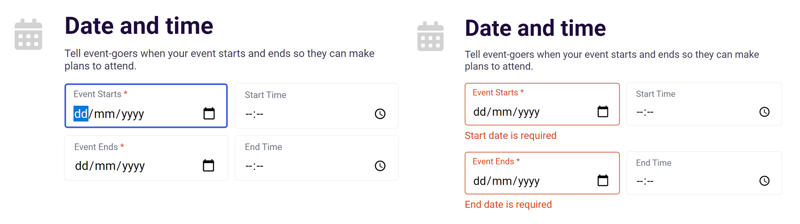

# Eventsight


Eventsight is an Eventbrite clone. It replicates the ability to create, register and view events hosted by diffferent organizer. 

[**View Eventsight Live**](https://eventsight.herokuapp.com/)

## Technologies

Backend:
- Ruby on Rails
- PostgreSQL
- jQuery-rails

Frontend:
- React
- Redux
- CSS/SASS

Hosting:
- AWS S3
- Heroku

## Features

- User authentication
- CRUD functionalities (Create, read, update and delete) for events and event registrations
- Uploading images to events

## Example Code

### Uploading images


One the the biggest technical challenge I had, is to persist the image attached to an event in the edit form. I found out it could be solved by utilizing the `imageUrl` generated by Ruby of Rails to show a preview of previously attached image, and conditionally add the `imageFile` to the `formData` for edit form submission.

```jsx
// frontend/components/event/event_form/event_form.jsx

const imagePreview = this.state.tempImageUrl ? (
    </img>
  ) : (
    </img>
  );
```

```jsx
handleSubmit(e) {
    e.preventDefault();
    const formData = new FormData();
    formData.append('event[organizer_id]', this.props.currentUserId);
    ...
    if (this.state.imageFile) {
      formData.append('event[image]', this.state.imageFile);
    } 
    this.props.action(formData, this.state.currEvent.id).then(
      (payload) => {
        this.props.history.push(`/events/${payload.event.id}`)
      });
  }
```

```jsx
handleFile(e) {
    const image = e.currentTarget.files[0];
    const fileReader = new FileReader();
    fileReader.onloadend = () => {
      this.setState({ imageFile: image, tempImageUrl: fileReader.result })
    }

    if (image) {
      fileReader.readAsDataURL(image);
    } else {
      this.setState({ imageFile: null, tempImageUrl: "" });
    }
  }
```

---
### Active field and errors styling



For the signup, login, create event and edit forms, active input field will be with visually labelled by a blue border, while fields which have error/missing value are visually labelled by a orange border alongside with the respective error message. Both styling is acheived by only applying CSS psuedo-class selectors.

```jsx
// frontend/components/event/event_form/event_form.jsx
render () {
  let startDateError = formErrors["Start"] 
    ? <p className="error-msg">Start date is required</p> 
    : "" ;
    
  return (
    <div className="start-date">
      <div className="input-wrapper">
        <label htmlFor="input-start-date">
          Event Starts <span className="red">*</span>
        </label>
        <input 
          type="date"
          id="input-start-date"
          value={currEvent.start_date}
          onChange={this.handleInput('start_date')} />
      </div>
      {startDateError}
    </div>
  )
}
```

```scss
// app/assets/stylesheets/api/event_form.scss

.event-form .input-wrapper {
  border: 3px solid transparent;

  label {
    color: $darker-gray;
  }

  &:focus-within {
    border: 2px solid $bright-blue;
    box-shadow: 0px 0px 1px rgb(190, 190, 190);
    transition: border 0.3s;
  }

  &:not(:only-child) {
    border: 1px solid $orange;
  
    label {
      color: $orange;
    }
  }
```

## Future Implementations

- Implement search function